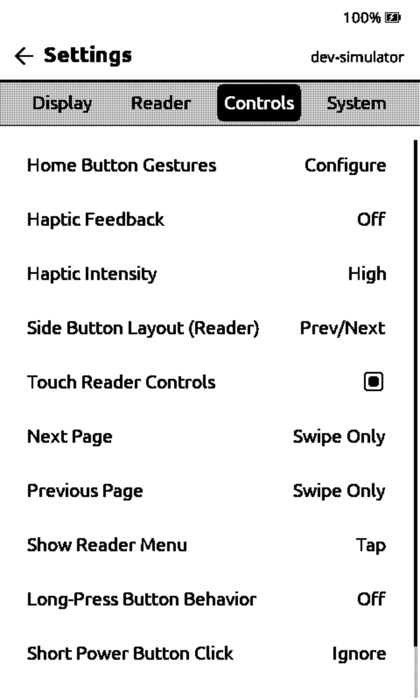
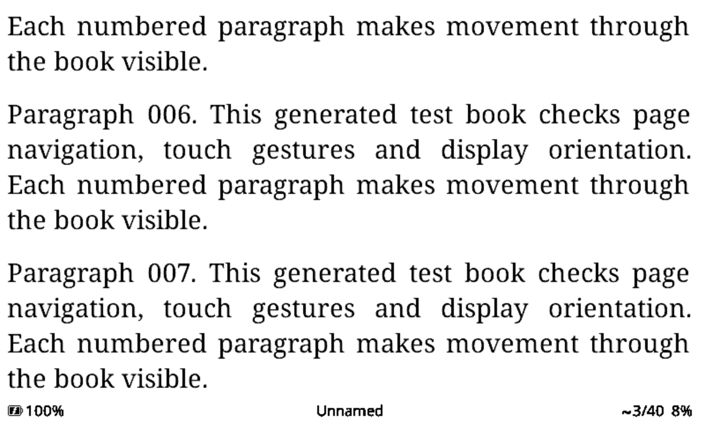

# Metalio E-Ink 4 simulator profile

Build the consuming firmware with `pio run -e simulator_metalio_eink4` using
one of the sample PlatformIO configurations. The profile targets CrossPoint's
`metalio_eink4` environment, added in firmware PR #3825.

## Source contract

The reference is the FreeInk SDK revision pinned by CrossPoint develop
`56c677f680f836172033bd5c9cda8bac8b992b72`:
[`aef1a6c89e36f331b2e1aacbbf7ce0debdeb732a`](https://github.com/Free-Ink/freeink-sdk/tree/aef1a6c89e36f331b2e1aacbbf7ce0debdeb732a).

- [Board profile, lines 1598–1618](https://github.com/Free-Ink/freeink-sdk/blob/aef1a6c89e36f331b2e1aacbbf7ce0debdeb732a/libs/hardware/BoardConfig/include/BoardConfig.h#L1598-L1618)
- [CST816S cover-key handling](https://github.com/Free-Ink/freeink-sdk/blob/aef1a6c89e36f331b2e1aacbbf7ce0debdeb732a/libs/hardware/InputManager/src/InputManager.cpp#L1566-L1591)
- [SDK hardware support notes](https://github.com/Free-Ink/freeink-sdk/blob/aef1a6c89e36f331b2e1aacbbf7ce0debdeb732a/docs/metalio-eink4-support.md)

| SDK contract | Simulator behavior |
| --- | --- |
| `MetalioEInk4`, `metalio_eink4` | Matching board identity and firmware device flag |
| SSD1677, 800×480 | 48,000-byte monochrome framebuffer; no Xteink controller overrides |
| Default viewable insets: top/right/bottom/left 9/3/3/3 | Same native panel insets |
| CST816S touch; panel X = raw Y, panel Y = 479 − raw X | Mouse and scripted touch enter normalized panel coordinates through the existing orientation transform |
| BOOT GPIO0 → Confirm; POWER GPIO3 → Power | Return and P |
| TCA9555 volume up/down → Up/Down | Up and Down arrows / scripted UP and DOWN |
| Cover PREV/NEXT → capacitive Up/Down | Page Up/Page Down / scripted PREV and NEXT; separate capacitive press/hold reporting |
| Cover HOME at raw (80,900) | H / scripted HOME; press, tap, long-press events |
| No Back/Left/Right button contacts | These keyboard and scripted button actions are ignored |
| PCF8563 RTC | Host-backed clock available |
| SC7A20H accelerometer | Tilt HAL available; generated tilt events remain unsupported |
| GPIO44 haptics | Haptic settings available; feedback API is a host no-op |
| No frontlight | Frontlight unavailable |
| ESP32-S3; 16 MB flash / 8 MB PSRAM | S3 firmware selection and `BOARD_HAS_PSRAM`; existing host memory shim does not reproduce PSRAM |

The SDK's input GPIO fields for Up/Down are unassigned because those contacts
come from the I²C expander and cover-key decoder. Keep them unassigned in the
simulated board profile; the HAL still delivers the logical Up/Down events.
Metalio is neither a runtime-detected C3 Xteink device nor an edge-side-button
board under the firmware's `HalGPIO` classification.

## Scope and verification

This is an application/HAL preview. It does not emulate CST816S I²C reports,
expander sequencing, motor output, audio/microphone, battery hardware, USB-MSC,
modem operation, power rails, display waveforms, or physical memory pressure.
Grayscale uses the existing generic host preview rather than the SDK driver's
mode support, waveform sequence, or asynchronous timing contract.
The SDK notes contain hardware-source discrepancies and validation limits;
a native simulator run cannot resolve them.

Use a separate working directory with its own `fs_` to avoid changing a real
SD card or another simulator's persisted settings. Exercise touch taps and
swipes in all four reading orientations, Return/Up/Down navigation, H tap and
hold, and sleep/wake. Verify About reports `metalio_eink4` and SSD1677 and that
frontlight controls are absent. Screenshots and process logs document firmware
behavior; they are not physical hardware validation.

Run the native HAL regression checks without a firmware checkout:

```sh
python3 tests/check-profile-selection.py
sh tests/run-metalio.sh
```

The input tests compile the real simulator GPIO/clock/tilt/frontlight code with
a geometry-only renderer stub. Full firmware runs are also needed to verify
reader gesture routing and rendered screens. CrossPoint swaps raw Up/Down
navigation in inverted and counter-clockwise orientations; cover and volume
keys follow that same application policy.

On the referenced firmware revision, About's touch-controller name switch
omits CST816S and displays Touch: No even though touch is enabled and works.
The simulator preserves the actual CST816S identity; the missing name case
belongs in the firmware's `AboutActivity.cpp`.

## Native firmware QA

On the referenced develop revision, both `simulator_metalio_eink4` and
`simulator_x4_pro` built successfully on macOS with a local compatibility
fixture. Pristine develop has unrelated native build blockers: device crypto
and protected-book code, host web String/JSON APIs and clock setting. The QA
fixture disables device-only crypto/book-key endpoints and protected-book
integration, adapts the host web APIs, and suppresses host `settimeofday`.
A sample configuration hook referring to a missing content-protection script
was also removed locally. None of those firmware fixture edits is in this PR.

With that fixture, scripted firmware runs exercised reading in all four
orientations, cover and volume page turns, touch taps and swipes, Home tap
and long press, settings, and native sleep/wake. Screenshot comparisons
verified reverse turns restore the original page and cover/volume/touch
advance to the same rendered page. X4 Pro touch/settings/Home also passed.
These runs do not establish pristine-develop native build compatibility.

The screenshots below use a generated test EPUB. Haptic controls are exposed;
physical vibration is not simulated.




